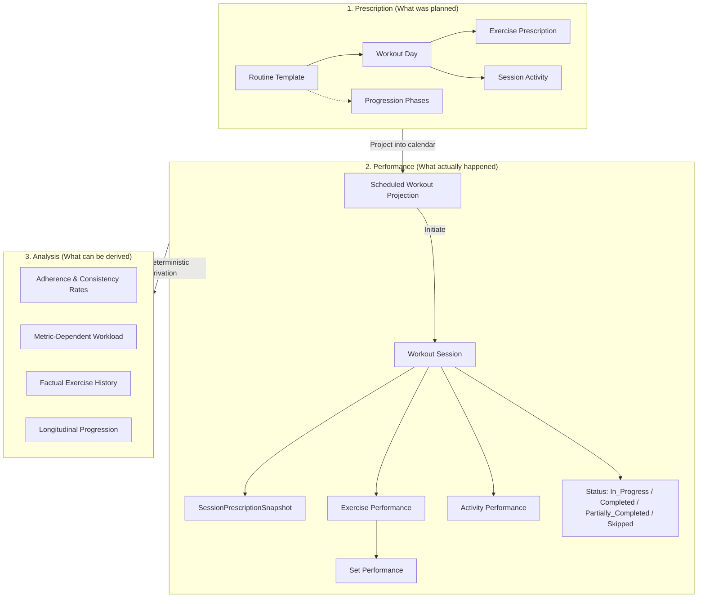

# Praxis

> *Praxis* (from Greek/Latin for *"the practical application of a plan"*) is a self-hosted workout execution and habit-tracking platform designed for homelab deployment.

Unlike conventional fitness apps that conflate planned routines with actual performance or impose punitive streak mechanics, Praxis is built around a strict **Three-Layer Temporal Model** and a clean hexagonal architecture.

---

## Architecture: The Three-Layer Temporal Model

1. **Prescription**: Reusable `Routine` templates defining weekly schedules (`Monday`–`Sunday`), target exercises, reps/ranges, weights, durations, activities (warm-ups, cardio), and calendar-week **Progression Phases**.
2. **Performance**: Concrete `WorkoutSession` instances created upon initiation. Each session freezes an immutable `SessionPrescriptionSnapshot` while providing total runtime autonomy to log sets, adjust weights/reps, swap exercises, or add unscheduled movements without corrupting the routine template.
3. **Analysis**: Factual, deterministic observations (adherence rates, workload volumes, progression curves) derived purely from historical session logs rather than mutable counters.

---

## Core Domain Invariants

- **Snapshot Immutability**: When a session is initiated, its prescribed targets are frozen. Future modifications to routines never alter past or in-progress workouts.
- **Session Autonomy**: The routine is a guide, not a tyrant. Users can adjust sets/reps on the fly, substitute movements, or record ad-hoc workouts.
- **Substituted History Isolation**: Substituted exercises contribute strictly to the history of the *performed* movement, leaving the originally planned exercise clean while preserving the substitution audit trail.
- **Factual Adherence**: Consistency is measured via distribution rates (`Completed`, `Partially_Completed`, `Skipped`, and `Set Adherence Rate`) rather than fragile binary streaks.
- **Decoupled Identity**: Business logic depends only on internal `UserId`. External authentication (Authelia forward-auth headers, LLDAP) is isolated behind an `AuthProvider` port.

---

## Project Specifications

Detailed requirements and design documents are maintained in `docs/`:

| Document | Version | Description |
| :--- | :--- | :--- |
| [`docs/praxis-srs-v1.0.2.md`](docs/praxis-srs-v1.0.2.md) | `1.0.2-draft` | Software Requirements Specification baseline. |
| [`docs/praxis-domain-model-v1.0.1.md`](docs/praxis-domain-model-v1.0.1.md) | `1.0.1` | Domain aggregates, entities, value objects, behavioral contracts, and use cases. |
| [`docs/praxis-srs.md`](docs/praxis-srs.md) | `1.0.0` | Initial SRS draft (archived for comparison). |
| [`docs/praxis-domain-model.md`](docs/praxis-domain-model.md) | `1.0.0` | Initial domain model draft (archived for comparison). |

---

## Implementation Roadmap

- **Milestone 1 (MVP Foundation)**:
  - Domain aggregates (`Routine`, `WorkoutSession`, `Exercise`) with zero external dependencies.
  - Multi-modal set logging (reps/weight, timed duration) and session activities.
  - Session snapshot engine (`SessionSnapshotFactory`) with phase set adjustments.
  - Set-intent completion policy and factual adherence metrics.
  - Hexagonal ports: `AuthProvider` (Authelia forward-auth), SQL repositories (SQLite/PostgreSQL).
  - FastAPI / REST API endpoints and Dockerized homelab deployment.
- **Milestone 2 (Evolution)**:
  - Estimated 1RM (Epley formula) and personal record (PR) calculations.
  - Interactive progression and workload trend charts.
  - Automated phase transition alerts.
  - Mobile-first Progressive Web App (PWA).
- **Milestone 3 (Advanced)**:
  - Rest interval timers and rest-pause tagging.
  - Equipment availability substitution suggestions.
  - Webhook event notifications.

---

## License

See [LICENSE](LICENSE) for details.
